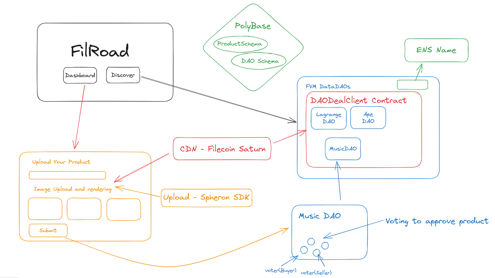

# ReadMe

# FiLroaD - A DataDao Aggregator for buying and selling digital products on FVM (inspired by Gumroad)

## Sponsor Technologies

1. FVM - To generate DataDAOs using the `DAODealClient.sol` using the Governance module from Openzepplin.
   1. Contracts
      1. [DAODealClient.sol](https://github.com/Akshit1311/hackfs-2023/blob/main/packages/blockchain/contracts/DaoDealClient.sol) - [0xd322D0278d12EcbACe3A522F383a9Fc589F044d7](https://calibration.filfox.info/en/address/0xd322D0278d12EcbACe3A522F383a9Fc589F044d7) - DealClient file to make deal proposals after a proposal is passed, controlled by the TimeLock.sol contract.
      2. [GovToken.sol](https://github.com/Akshit1311/hackfs-2023/blob/main/packages/blockchain/contracts/DataDAO/GovToken.sol) - [0x2511Fa67e6c83Ce2153D1edA05215bC1C1E2B8f7](https://calibration.filfox.info/en/address/0x2511Fa67e6c83Ce2153D1edA05215bC1C1E2B8f7) - The DAO Token that incentivizes DAO members to vote and propose proposals (buy or sell digital products).
      3. [TimeLock.sol](https://github.com/Akshit1311/hackfs-2023/blob/main/packages/blockchain/contracts/DataDAO/TimeLock.sol) - [0x43890Ac592B92f1A9F8a4383886D6463361BC75C](https://calibration.filfox.info/en/address/0x43890Ac592B92f1A9F8a4383886D6463361BC75C) - A time lock contract to await for the DAO members to make decisions before the proposal goes through.
      4. [GovernorContract.sol](https://github.com/Akshit1311/hackfs-2023/blob/main/packages/blockchain/contracts/DataDAO/GovernorContract.sol) - [0x02f006d1a8B6BB58E8545172A278d854fC6548e8](https://calibration.filfox.info/en/address/0x02f006d1a8B6BB58E8545172A278d854fC6548e8) - The Governance Contract handling all the logic for the DAO and dealing with proposals.
   2. Deployment Script - [https://github.com/Akshit1311/hackfs-2023/blob/main/packages/blockchain/deploy/01_deploy_all.ts](https://github.com/Akshit1311/hackfs-2023/blob/main/packages/blockchain/deploy/01_deploy_all.ts)
   3. Frontend Contract Call - [https://github.com/Akshit1311/hackfs-2023/blob/main/apps/web/src/config/viem/governor.ts](https://github.com/Akshit1311/hackfs-2023/blob/main/apps/web/src/config/viem/governor.ts) - Used the library **viem** for contract interaction.
2. Filecoin Saturn 🪐 - To accelerate the data retrievals from IPFS using the Saturn CDN.
   1. ServiceWorker for Enabling CDN - [https://github.com/Akshit1311/hackfs-2023/blob/main/apps/web/public/saturn-sw.js](https://github.com/Akshit1311/hackfs-2023/blob/main/apps/web/public/saturn-sw.js)
   2. Widget Code Integration - [https://github.com/Akshit1311/hackfs-2023/blob/b8b943b18aa3d3d39aca12531143b2406485f7a7/apps/web/src/app/layout.tsx#LL12C9-L12C55](https://github.com/Akshit1311/hackfs-2023/blob/b8b943b18aa3d3d39aca12531143b2406485f7a7/apps/web/src/app/layout.tsx#LL12C9-L12C55)
3. Spheron - To upload and pin images on the ipfs network and create deals on FVM.
   1. Storage An Retrieval of Files - [https://github.com/Akshit1311/hackfs-2023/blob/b8b943b18aa3d3d39aca12531143b2406485f7a7/apps/web/src/app/dashboard/components/PublishProduct/NewProduct/FileUpload/FileUploadInput.tsx](https://github.com/Akshit1311/hackfs-2023/blob/b8b943b18aa3d3d39aca12531143b2406485f7a7/apps/web/src/app/dashboard/components/PublishProduct/NewProduct/FileUpload/FileUploadInput.tsx)
4. Polybase - To store products and DAO schema atrributes and leverage it while creating and listing products
   1. Schema. Methods and CRUD Operations - [https://github.com/Akshit1311/hackfs-2023/blob/main/apps/web/src/app/polybase/db.ts](https://github.com/Akshit1311/hackfs-2023/blob/main/apps/web/src/app/polybase/db.ts)
   2. Usage of methods
      1. Write Method - [https://github.com/Akshit1311/hackfs-2023/blob/b8b943b18aa3d3d39aca12531143b2406485f7a7/apps/web/src/app/dashboard/components/PublishProduct/NewProduct/NewProduct.tsx#LL44C11-L44C11](https://github.com/Akshit1311/hackfs-2023/blob/b8b943b18aa3d3d39aca12531143b2406485f7a7/apps/web/src/app/dashboard/components/PublishProduct/NewProduct/NewProduct.tsx#LL44C11-L44C11)
      2. Read Method - [https://github.com/Akshit1311/hackfs-2023/blob/b8b943b18aa3d3d39aca12531143b2406485f7a7/apps/web/src/components/Showcase/Showcase.tsx#LL118C11-L118C11](https://github.com/Akshit1311/hackfs-2023/blob/b8b943b18aa3d3d39aca12531143b2406485f7a7/apps/web/src/components/Showcase/Showcase.tsx#LL118C11-L118C11)
   3. Rough Testing - [https://github.com/Akshit1311/hackfs-2023/blob/main/apps/web/src/app/polybase/page.tsx](https://github.com/Akshit1311/hackfs-2023/blob/main/apps/web/src/app/polybase/page.tsx)
5. ENS - Resolution and Reverse Resolution of ENS Names/ Wallet Addresses and fetching PFPs from the Eth Network.
   1. ENS Resolution - [https://github.com/Akshit1311/hackfs-2023/blob/b8b943b18aa3d3d39aca12531143b2406485f7a7/apps/web/src/utils/helpers.ts#L18](https://github.com/Akshit1311/hackfs-2023/blob/b8b943b18aa3d3d39aca12531143b2406485f7a7/apps/web/src/utils/helpers.ts#L18)
   2. Reverse Resolution of Address - [https://github.com/Akshit1311/hackfs-2023/blob/b8b943b18aa3d3d39aca12531143b2406485f7a7/apps/web/src/utils/helpers.ts#L31](https://github.com/Akshit1311/hackfs-2023/blob/b8b943b18aa3d3d39aca12531143b2406485f7a7/apps/web/src/utils/helpers.ts#L31)
   3. ENS PFP Fetching - [https://github.com/Akshit1311/hackfs-2023/blob/b8b943b18aa3d3d39aca12531143b2406485f7a7/apps/web/src/app/profile/[pId]/page.tsx#L27](https://github.com/Akshit1311/hackfs-2023/blob/b8b943b18aa3d3d39aca12531143b2406485f7a7/apps/web/src/app/profile/%5BpId%5D/page.tsx#L27)
6. DataverseOS - Attempt to share encrypted digital product data from seller to buyer directly through FVM.
   1. Runtime Connecter - [https://github.com/Akshit1311/hackfs-2023/blob/anj/walletIntegration/apps/web/src/app/dataverseOS/page.tsx](https://github.com/Akshit1311/hackfs-2023/blob/anj/walletIntegration/apps/web/src/app/dataverseOS/page.tsx)
   2. Types for Typescript - [https://github.com/Akshit1311/hackfs-2023/blob/anj/walletIntegration/apps/web/src/app/dataverseOS/context.ts](https://github.com/Akshit1311/hackfs-2023/blob/anj/walletIntegration/apps/web/src/app/dataverseOS/context.ts)
